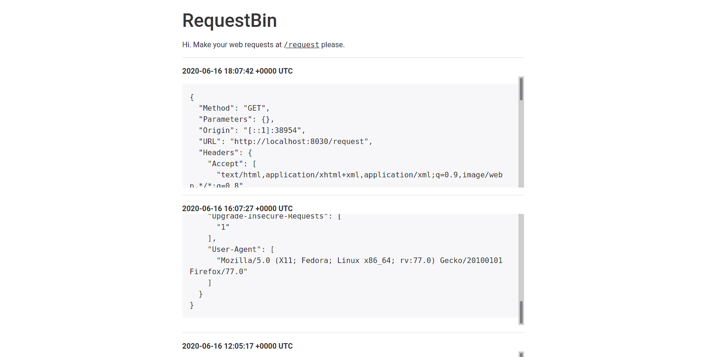

# RequestBin

RequestBin is like httpbin, but it logs requests so that you can see them later. Might be shoddy work, I built this to replace my PHP based soln for the same and I wanted to play with Go.

* Single endpoint for accepting all kinds of requests.
* Sends back everything it receives as response. (except multipart files for now)
* Saves request logs so that they can be seen later.
* Basic http authentication to view logs.
* Usecase: Test API clients, common endpoint to send random stuff.

